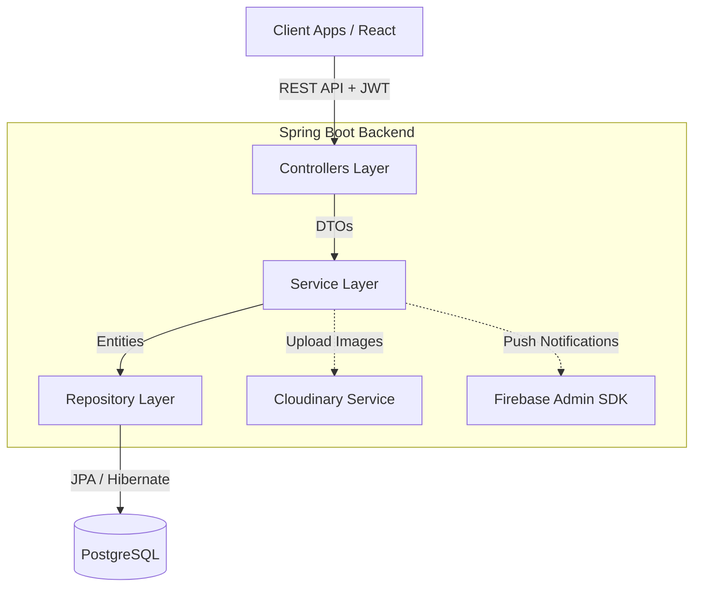

# EventPro 🚀


EventPro is a comprehensive Event Management Platform designed to streamline the coordination between event administrators and field workers. It provides real-time tracking, assignment management, and photographic reporting to ensure operational excellence at every event.

🔗 **Live Demo:** [eventpro-app.vercel.app](https://eventpro-app.vercel.app)

---

## ✨ Features

- **Role-Based Access Control (RBAC):** Secure authentication and authorization for Admins and Workers using JWT.
- **Event & Staff Management:** Admins can create events, assign workers to specific duties, and track their performance.
- **Real-time Check-ins:** Workers can check in and out of their assigned events, with geolocation data and photographic evidence.
- **Live Reporting system:** Workers can submit live incidence reports with multiple photo attachments to keep administrators informed.
- **Push Notifications:** Instant alerts for administrators when new reports or critical updates occur, powered by Firebase Cloud Messaging (FCM).
- **Cloud Storage Integration:** Scalable media storage handled seamlessly with Cloudinary.

## 🛠️ Tech Stack

### ⚡ Frontend
- **React (Vite)**
- **Tailwind CSS** for responsive and modern UI
- **PWA Ready**

### ⚙️ Backend
- **Java 21 & Spring Boot 3**
- **Spring Security** (JWT Authentication)
- **Spring Data JPA / Hibernate**
- **PostgreSQL**
- **Cloudinary SDK** (Media Management)
- **Firebase Admin SDK** (Push Notifications)

### 🐳 Infrastructure
- **Docker & Docker Compose**
- **Nginx** (Reverse Proxy & Static serving)

---

## 🏗️ Backend Architecture

The backend follows a robust, scalable **N-Tier Architecture (Layered Architecture)**, enforcing separation of concerns and maintainability.



### Architectural Principles:
1. **Controller Layer:** Exposes RESTful endpoints, handles HTTP requests/responses, and validates incoming payloads (DTOs).
2. **Service Layer:** Encapsulates the core business logic. It handles data processing, transactions, and coordinates communication with external APIs (like Cloudinary and Firebase).
3. **Repository Layer:** Extends Spring Data JPA interfaces for seamless and secure data access, abstracting raw SQL queries into method name conventions or isolated `@Query` executions.
4. **DTO Pattern:** The Data Transfer Object pattern is strictly enforced at the Controller borders to prevent exposing sensitive internal Domain/Entity models to the clients.
5. **Security:** Stateless authentication using JSON Web Tokens (JWT). A custom security filter intercepts requests to extract, validate, and set the user's security context.

---

## 🚀 Getting Started (Local Development)

The application is fully containerized. To spin up the entire stack (Database, Backend, Frontend reverse-proxied by Nginx) locally:

### Prerequisites
- Docker & Docker Compose installed.

### Installation
1. Clone the repository:
```bash
git clone https://github.com/Terror-Mex/EventosApp.git
cd EventosApp
```

2. Run Docker Compose:
```bash
docker-compose up --build -d
```

3. The application will be running at:
- **Frontend:** http://localhost
- **Backend API:** http://localhost:8080
- **Database:** localhost:5432

> **Note:** For specific features like photo uploads and push notifications to work locally, appropriate environment variables for Cloudinary and Firebase must be supplied.

---
*Built with ❤️ for better event coordination.*
